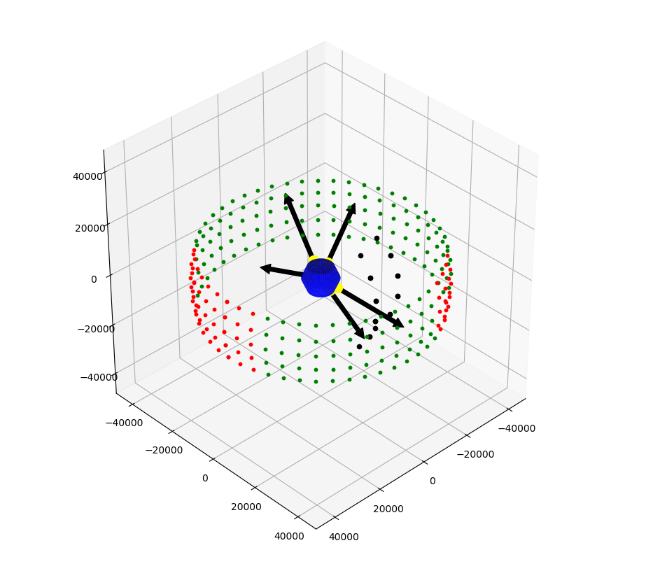
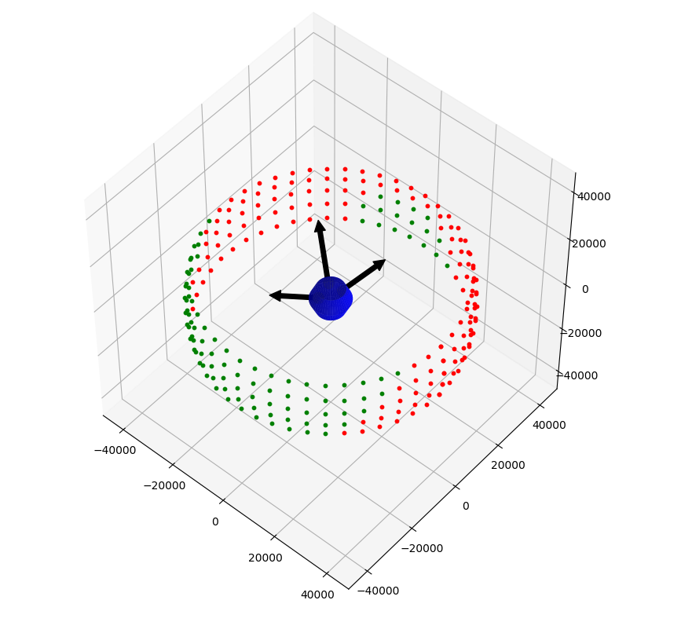
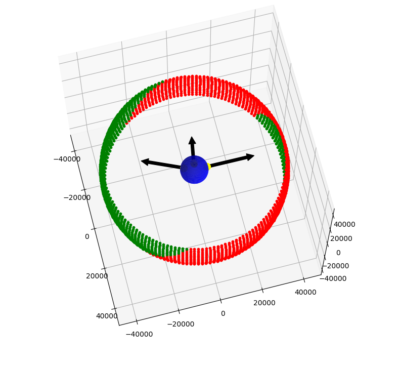
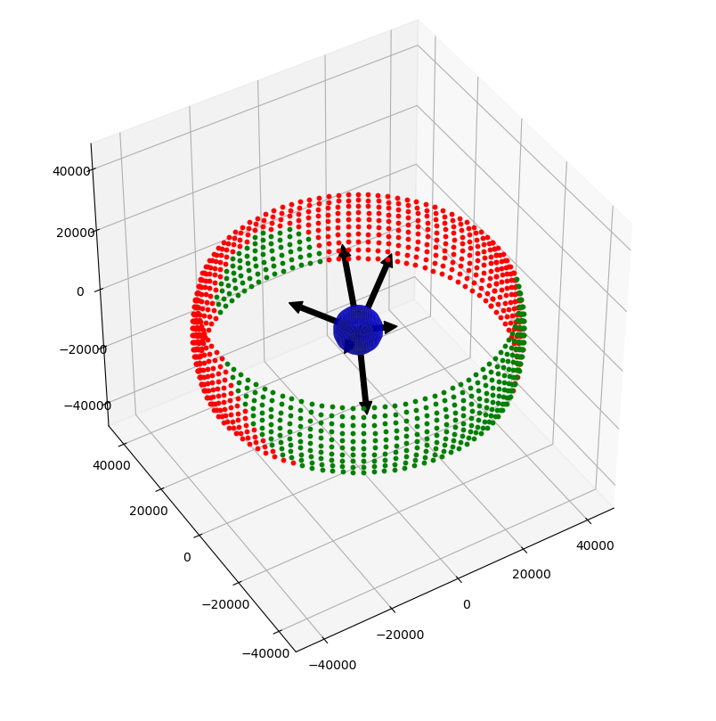

# telescope_coverage

### **VERSION**
1.0

### **AUTHORS**
Jacob Sampson  
Luke Van Drie

----

This application models satellites in geostationary orbit around the Earth in order to determine the coverage offered by existing telescopes and potential new sites for new telescopes.

## **Feature list**

Current list of included features

- Visualization of telescope coverage
  - Specify satellite band width
  - Specify telescope angle coverage
- Percentage covered
- Latitudinal and longitudinal plotting for existing telescopes
- Random, evenly-spaced positioning for new telescopes

## **Basic example of weather blocking telescopes**

## **Manually-placed telescopes**

## **Randomly-placed telescopes**

## ***Features to add***

- *Multiple geostationary orbit belts*
- *Angled telescopes*
- *Land-based placement*
- *Weather data*